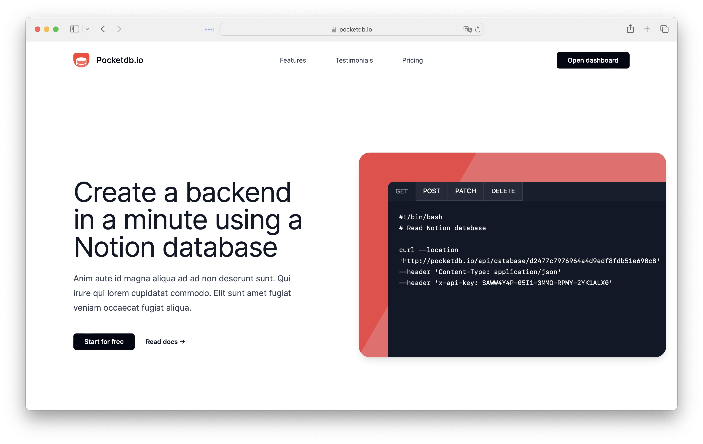
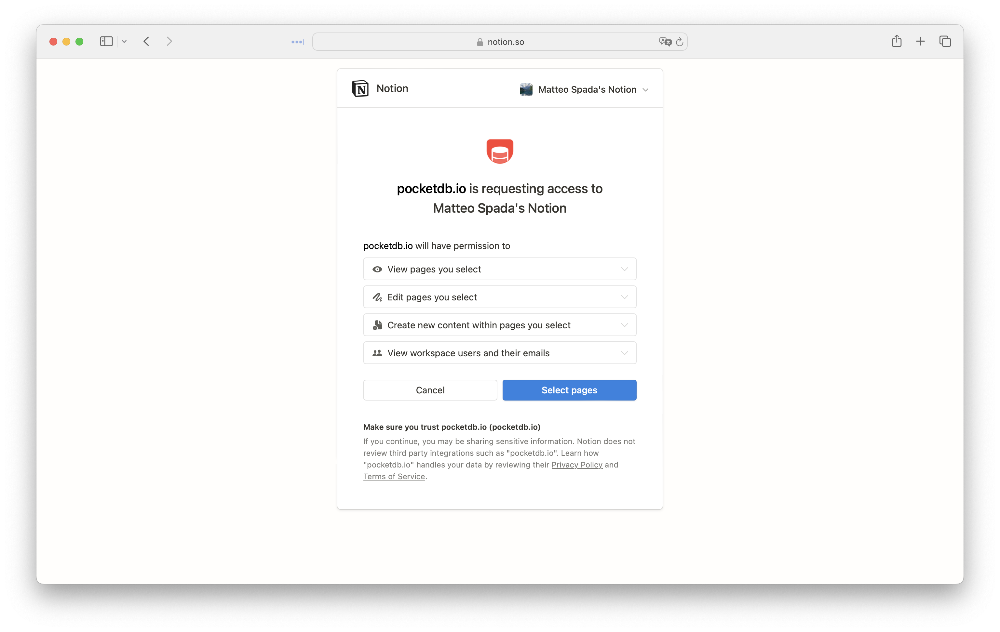
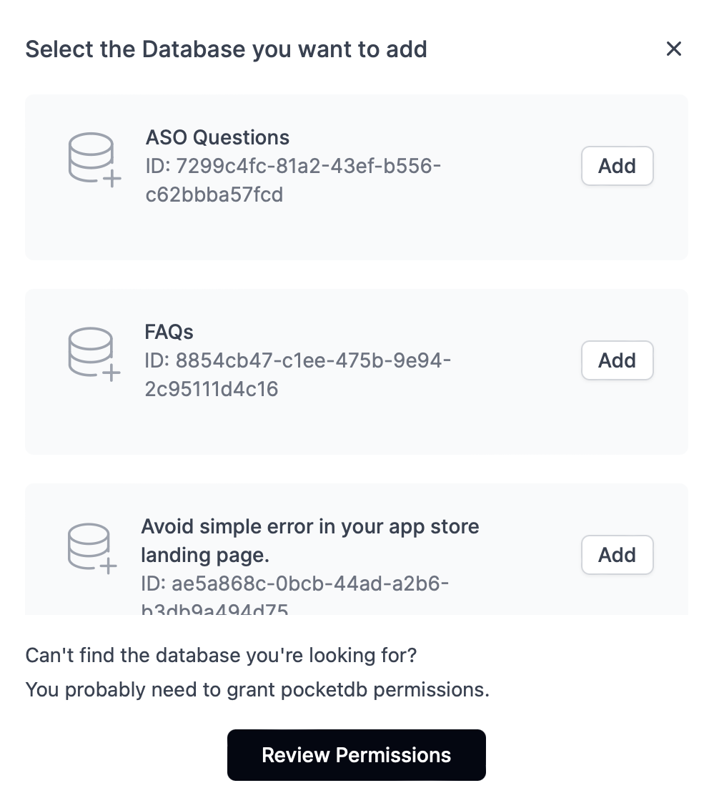
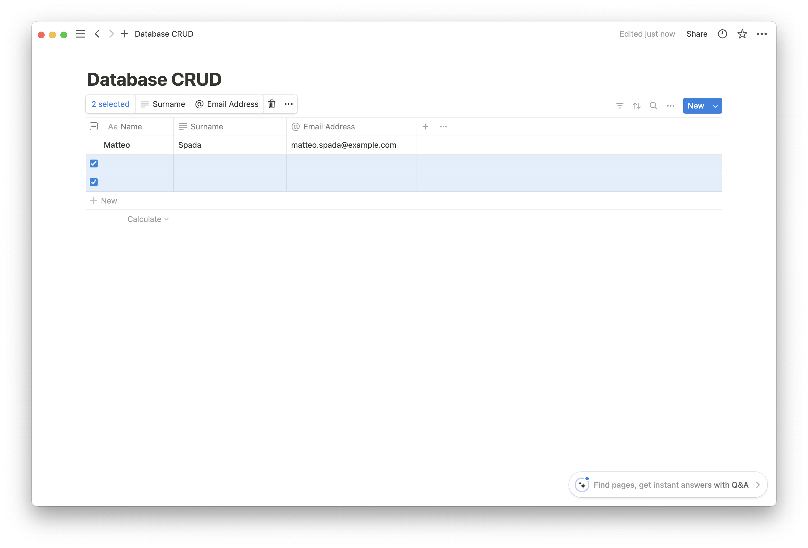

# Getting Started

## Login

The first step is to log in to Pocket DB using your Notion account. Simply click on "Login with Notion" at the top of the homepage.



You will be asked for permission to access your account information. Pocket DB requires the following permissions to function properly:

- Read your Full Name and email address to authenticate your account.
- Read and write to your Notion databases to allow you to interact with them via API.

Click on Allow and then select the databases to which you want to grant permissions. You can always modify your choices within the Account section.



**Note: If you remove permissions from a database previously added to Pocket DB, the integration will immediately stop working.**

## Adding the First Database

Connecting a Notion database is straightforward. Simply click on "Add DB" and then select the database you want to add by clicking the "Add" button.



If you don't find the database you are looking for in the list, make sure you have provided the necessary permissions by clicking on review permissions, or ensure that the page you want to add is indeed a Notion database. If you're unsure how to create a database, you can follow this guide.

Each new database is generated with an API key that can be used to authenticate API calls, ensuring that only you can access your database.

To delete or modify your database settings, click on the Edit button. We will delve into all possible configurations later in this guide. To delete the newly added database, click on delete and confirm.

## GET: Read Data from the Database

Now that you have added your first database, we can add some data and try reading it. In Notion, add the Name and email columns to the database and enter a name and email address of your choice (this is just an example to have some data to read). Also, delete the two empty rows generated with the Notion database.



Reading data from the newly created database is simple. Just execute this curl command, replacing the database ID and API key with your own. You can copy these two pieces of data directly from your database row.

```
curl --location 'http://pocketdb.io/api/database/{databaseid}' \
    --header 'x-api-key: {yourapikey}' \
    --header 'Accept: application/json'
```

This call will return the following output. The "id" field represents the ID of the respective row, which we will need shortly when we look at how to delete or modify a row.

```
[
    {
        "id": "1726a654-b351-4d75-accd-31789c666dea",
        "createdTime": "2024-04-15T09:13:00.000Z",
        "lastEditedTime": "2024-05-13T12:51:00.000Z",
        "Surname": "Spada",
        "Email Address": "matteo.spada@example.com",
        "Name": "Matteo"
    }
]
```

## POST: Add a Row

To add a row, simply make a POST call and pass the data to be added to the database in the request body. Only the data corresponding to the column headers, in our case Name, Surname, and Email Address, are mandatory.

```
curl --location 'http://pocketdb.io/api/database/{databaseid}'' \
--header 'x-api-key: {apikey}' \
--header 'Content-Type: application/json' \
--data-raw '    {
    "Surname": "Rossi",
    "Email Address": "mario.rossi@example.com",
    "Name": "Mario"
}'
```

Output: The newly created object is returned, complete with an "id" that we can use to modify or delete it.

```
{
    "id": "7f2f3741-7085-452f-a39a-b6043438e2c1",
    "title": "Mario",
    "url": "https://www.notion.so/Mario-7f2f37417085452fa39ab6043438e2c1",
    "archived": false,
    "createdTime": "2024-05-13T13:48:00.000Z",
    "lastEditedTime": "2024-05-13T13:48:00.000Z",
    "properties": {
        "Surname": "Rossi",
        "Email Address": "mario.rossi@example.com",
        "Name": "Mario"
    }
}
```

## PATCH: Modify a Row

We can modify a row in our database simply by having the row's ID. More specifically, each row in our database corresponds to a page in Notion, so the row's ID is also known as the page ID. Let's take the page ID of the previously created row (7f2f3741-7085-452f-a39a-b6043438e2c1) as an example.

In this example, we have changed the Surname field from Rossi to Bianchi and the Email Address field from mario.rossi@example.com to mario.bianchi@example.com.

```
curl --location --request PATCH 'http://pocketdb.io/api/database/{databaseid}/{pageid}' \
    --header 'x-api-key: {apikey}' \
    --header 'Content-Type: application/json' \
    --data-raw '{
        "Surname": "Bianchi",
        "Email Address": "mario.bianchi@example.com"
    }'
```

The modified row is returned as output:

```
{
    "id": "7f2f3741-7085-452f-a39a-b6043438e2c1",
    "title": "Mario",
    "url": "https://www.notion.so/Mario-7f2f37417085452fa39ab6043438e2c1",
    "archived": false,
    "createdTime": "2024-05-13T13:48:00.000Z",
    "lastEditedTime": "2024-05-13T14:01:00.000Z",
    "properties": {
        "Surname": "Bianchi",
        "Email Address": "mario.bianchi@example.com",
        "Name": "Mario"
    }
}
```

## DELETE: Delete a Row

To delete a row from the database, simply use the DELETE method.

```
curl --location --request DELETE 'http://pocketdb.io/api/database/{databaseid}/{pageid}' \
    --header 'x-api-key: {apikey}'
```